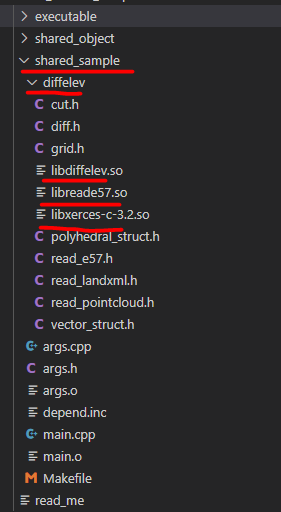
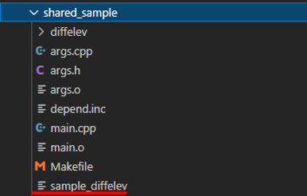
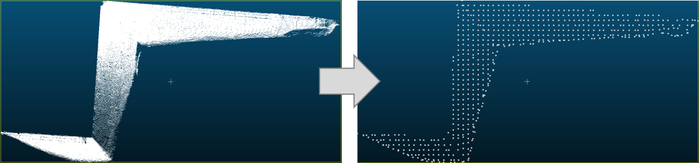
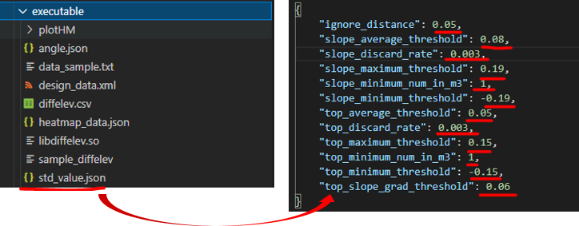
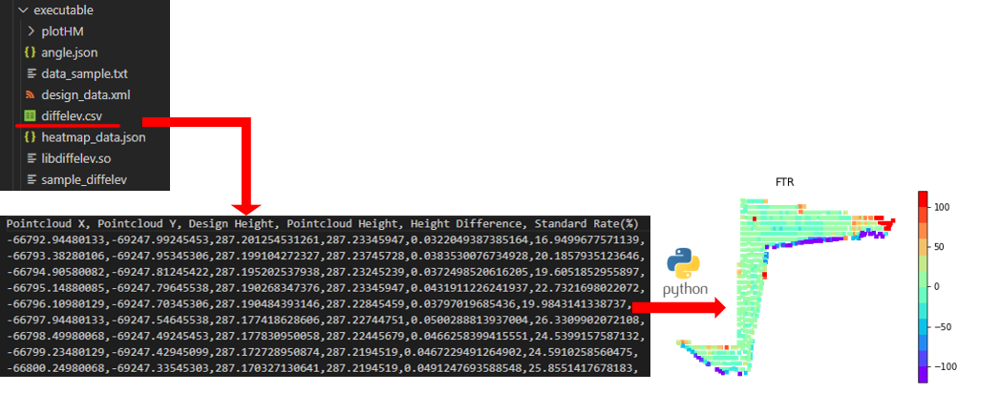
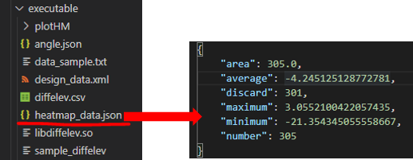
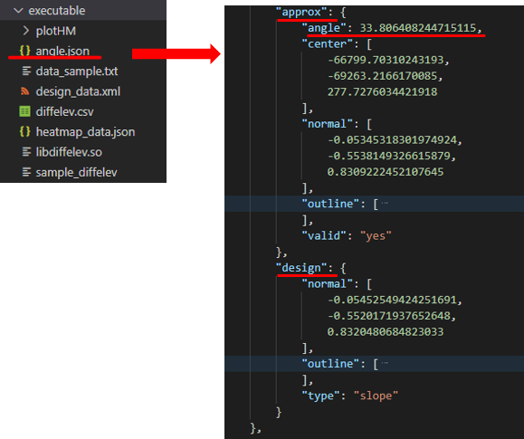
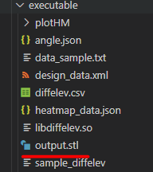

<!-- title: 手順書 -->
## 1. バイナリ ファイルのBuild & 実行

### 1.1. シンボリックリンクの構築
---

- In`shared_sample` フォルダ
```bash
ln -s ../shared_object diffelev
```
- `diffelev` フォルダー生成
  
- `libdiffelev.so`, `libreade57.so` and `libxerces-c-3.2.so` を `diffelev` フォルダーへ追加する


### 1.2. ファイルのBuild
---
- In `shared_sample` フォルダ, type:
```
make
```
- バイナリの実行ファイル `sample_diffelev` を生成する

<!--  -->
<!--  -->





### 1.3. ファイルの実行
---

- In current directory where .exe file locates, type:

```sh
./sample_diffelev
```

- 入力オプションの詳細を示す
```
Options:
  -p, --input-pcl       入力点群ファイルを指定します
  -g, --thin-grid       入力点群をグリッド毎に間引きます 計算方法を指定します
                        "maximum":グリッドのZ座標が最大値の点を残します
                        "minimum":グリッドのZ座標が最小値の点を残します
                        "median":グリッドのZ座標が中央値となる点を残します
                        "mode":グリッドのZ座標でヒストグラムを取った際の最瀕値となる点を残します 続けてヒストグラムの間隔を指定してください
                        "none":間引きを行いません
  -c, --cut-polygon     多角形を指定し、点群データからその内側にある点のみを抽出して残りを消去します
                        最初に多角形の点の数を指定し、続けて1点目のX座標、1点目のY座標、2点目以降...と指定します
  -n, --extract-near    設計データから近い点のみを抽出して残りを消去します
  -t, --thinned-pcl     間引かれたデータの出力先を指定します
  -o, --grid-origin     グリッドの基準位置を数値2つスペース区切りで設定します(初期値:0 0)
  -w, --grid-width      グリッドの感覚を数値2つスペース区切りで設定します(初期値:1 1)
  -s, --separator       入力ファイルの区切り文字を設定します(初期値:',')
  -i, --ignore-lines    入力ファイルの先頭何行を無視するかを指定します(初期値:0)
  -x, --input-landxml   設計データとなるLandXmlファイルを指定します
  -l, --output-stl      設計データから得られた表面形状を指定したファイルにSTL形式で出力します
  -d, --diff-elevation  較差を計算し、指定したファイルに計算結果を出力します
                        各グリッドの較差算出結果のcsvファイル、全体の評価結果のjsonファイルの順に指定します
  -v, --standard-value  較差の計算で使用する規格値等のパラメータが書かれたjsonファイルを指定します
  -u, --out-used-value  較差の計算で使用した規格値等のパラメータが書かれたjsonファイルの出力先を指定します
  -a, --slope-angle     法角度を計算し、指定したファイルに計算結果を出力します
  -j, --judge-slope     評価する点群が天面か法面かを判定する計算方法を指定します
                        "force-top":必ず天面として計算します
                        "force-slope":必ず法面として計算します
                        "calculation":近接の設計データを計算で求め、その傾きで天面か法面かを決定します
  -h, --help            このヘルプを表示します
```


## 2. 出力結果

### 2.1. 事前設定
---
#### 2.1.1. グリッドの基準位置およびサイズの設定 
* 点群密度を変更するため、まずグリッドを設置する(in m)
```sh
./sample_diffelev -o <defalut: 0 0> -w <default: 1 1>
```

#### 2.1.2. 入力点群ファイルの指定
* 指定されるパスから点群ファイルを読込む 
```sh
./sample_diffelev -p <path/to/point_cloud_file>
```

#### 2.1.3. 設計データ(LandXML)ファイルの指定
* 指定されるパスから設計データを読込む
```sh
./sample_diffelev -x <path/to/design_data_file>
```


### 2.2. 評価用点群の抽出
---

#### 2.2.1. 範囲指定に応じた点群の切り出し
* 範囲を指定する多角形の頂点および各頂点の座標を入力する
```sh
./sample_diffelev -c <多角形の頂点の数> <1点目のX座標> <1点目のY座標> <2点目以降...>
```  
<!----------------------------------------------------------------------------->

#### 2.2.2. 間引き方法の選択 & 出力先の指定
* 各グリッドにおいて点群密度を減らし、代表点のみを抽出する
```sh
./sample_diffelev -g {"maximum" | "minimum" | "median" | "mode"} -t <path/to/output_file>
```
<!----------------------------------------------------------------------------->
#### 2.2.3. 設計データから±x m範囲の点群抽出 (in m)
* 設計データから大いに離れる異常値を除外する
```sh
./sample_diffelev -n <default: 0.1>
```
<!----------------------------------------------------------------------------->

#### 2.2.4. 入力例
* 点群ファイルdata_sample.txtと設計データdesign_data.xmlを読込み
* 各グリッドにおいて「maximum」、そして設計データから±0.1m範囲の点群のみを抽出する
* 出力先は、同じディレクトリの「output.csv」に保存する
```sh
./sample_diffelev -p data_sample.txt -x design_data.xml -g "maximum" -n 0.1 -t output.csv
```
#### 2.2.5. 結果



### 2.3. 標高較差 & ヒートマップ用データの算出
---
#### 2.3.1. 出力先およびファイルの形式を指定する
* 標高較差 `diffelev.csv`、ヒートマップ用データは `heatmap_data.json` にそれぞれ保存する
```sh
./sample_diffelev -d diffelev.csv heatmap_data.json 
```

#### 2.3.2. 規格値の指定

* 事前に `std_value.json` というファイルを用意する

    (下記のコマンドにより`std_value.json`ファイルが生成できる)

```sh
./sample_diffelev -p data_sample.txt -u std_value.json
```
> `-u` オプションの指定だけでは何も計算処理が行われません。
>
> 他のオプションと組み合わせて使用する


* ファイル中身の数値を変更することによって、規格値を指定できる



* `std_value.json`ファイル:

| キー名  | 値の内容                               |
|---------|---------------------------------------|
| ignore_distance    | 法肩・法尻から±5cm以内に存在する計測点を除く  |
| slope_average_threshold | 法面の較差値の平均値 |
| slope_discard_rate | 法面の棄却点数の割合                         |
| slope_maximum_threshold | 法面の較差値の最大値                       |
| slope_minimum_num_in_m2 | 法面の1m2に対するデータ数                           |
| slope_minimum_threshold  | 法面の較差値の最小値（絶対値で指定） |
| top_average_threshold  | 天端の較差値の平均値 |
| top_discard_rate  | 天端の棄却点数の割合 |
| top_maximum_threshold  | 天端の較差値の最大値 |
| top_minimum_num_in_m2  |天端の1m2に対するデータ数|
| top_minimum_threshold  | 天端の較差値の最小値（絶対値で指定）|
| top_slope_grad_threshold  | 平場・法面を判断する基準（三角形の勾配＞0.06 → 法面とする） |


#### 2.3.3. 入力例
- 規格値を指定する「std_value.json」ファイルをオプションとして入力
- 点群ファイルのseparatorを確認し、`space`の場合は　`-s " "`が必要となる
```sh
./sample_diffelev -p data_sample.txt -x design_data.xml -g "maximum" -d diffelev.csv heatmap_data.json -v std_value.json -s " "
```
#### 2.3.4. 結果
* `diffelev.csv` 



* `heatmap_data.json`:
> 棄却点数の割合 < 規格値: 最大値、最小値、平均値には棄却点を除いて算出された値が記載されます。
>
> 棄却点数の割合 > 規格値: 最大値、最小値、平均値には棄却点を含めて算出された値が記載されます。




| キー名  | 値の内容                               |
|---------|---------------------------------------|
| area    | 較差値の最大値                         |
| average | 較差値の最小値                         |
| discard | 較差値の平均値                         |
| maximum | 評価点全体の個数                       |
| minimum | 棄却点の個数                           |
| number  | 評価した面積(= 評価点 数×グリッド面積) |


### 2.4. 法角度の算出
---
#### 2.4.1. 天端か法面かを判定する計算方法を指定する
- "force-top":天端として計算します
- "force-slope":法面として計算します
- "calculation":設計データによる設計面の傾斜角度により、天端か法面かを判定する
```sh
 ./sample_diffelev -j {"calculation" | "force-top" | "force-slope"}
```

#### 2.4.2. 出力先とファイルの形式を指定する
```sh
./sample_diffelev -a angle.json
```

#### 2.4.3. 入力例

```sh
./sample_diffelev -p data_sample.txt -x design_data.xml -g "maximum" -a angle.json -j "calculation"
```

#### 2.4.4. 結果（一部）



| キー名  | 値の内容                                         |
|---------|--------------------------------------------------|
| **approx**  | 近似平面の情報                                   |
|  angle      | 近似平面の法線とZ軸との角度                       |
|  center     | 近似平面の代表点                                 |
|  normal     | 近似平面の単位法線ベクトル                        |
| outline     | 点群データを覆う近似平面上の四角形を点群の外形線    |
|   valid     | 近似平面の計算が正常に終了したかを出力する         |
| **design**  | 近接の設計データの三角形グループの情報             |
|    type     | 設計データは平面か天端かを判断する                 |
|  normal     | 設計データの単位法線ベクトル                      |


## 3. 追加機能
### 3.1. STLの出力オプション
---
* -xと-lだけではSTLの出力ができないため、他のオプションと合わせて入力する
```sh
./sample_diffelev -p ixs_data_eval.txt -x ixs_design.xml -l output.stl
```



### 3.2. E57 fileの読込み機能を追加
---
* .txt点群ファイルと同じ扱い　
```sh
./sample_diffelev -p ixs_data_eval.e57 -x ixs_design.xml -d diffelev.csv heatmap.json -a angle.json -g maximum
```
* 結果は.txt点群ファイルの結果と同様